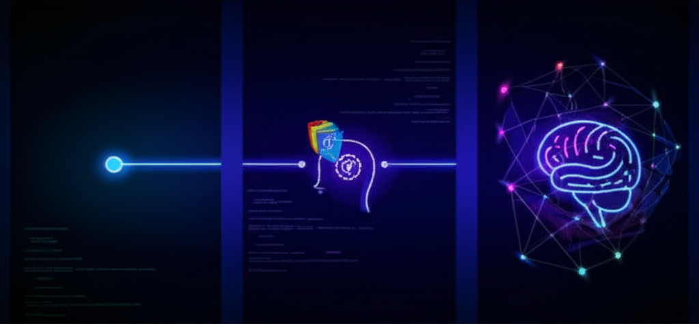
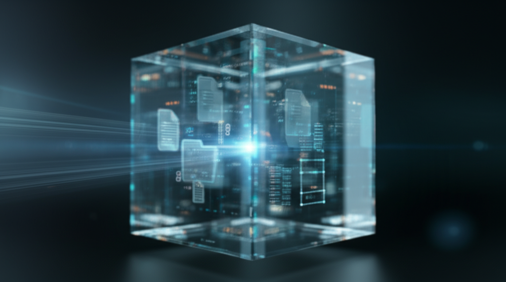
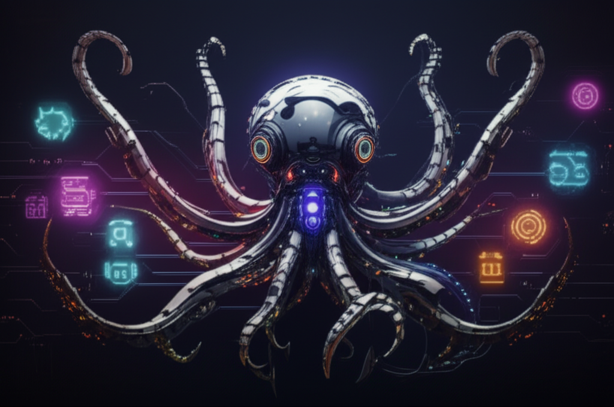
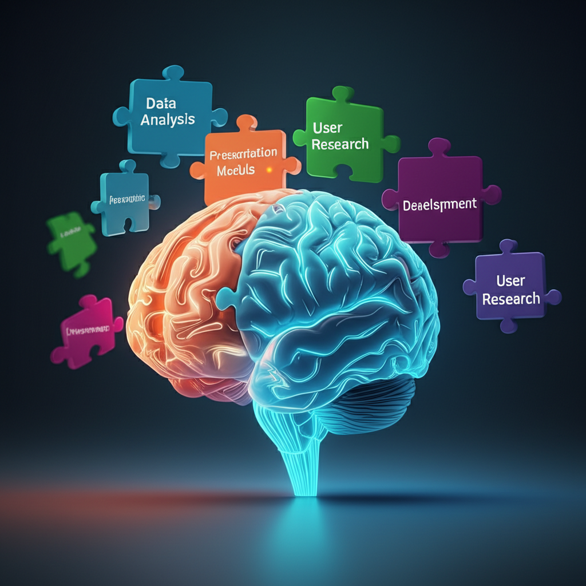
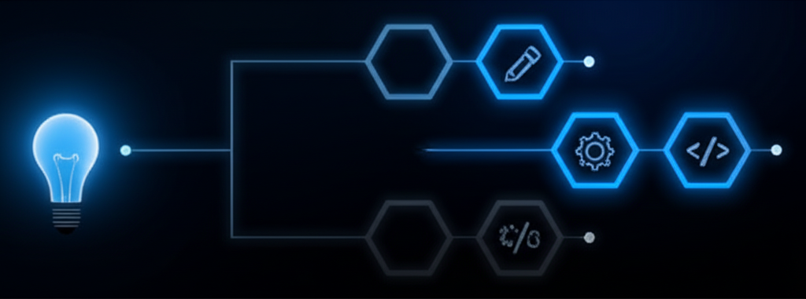
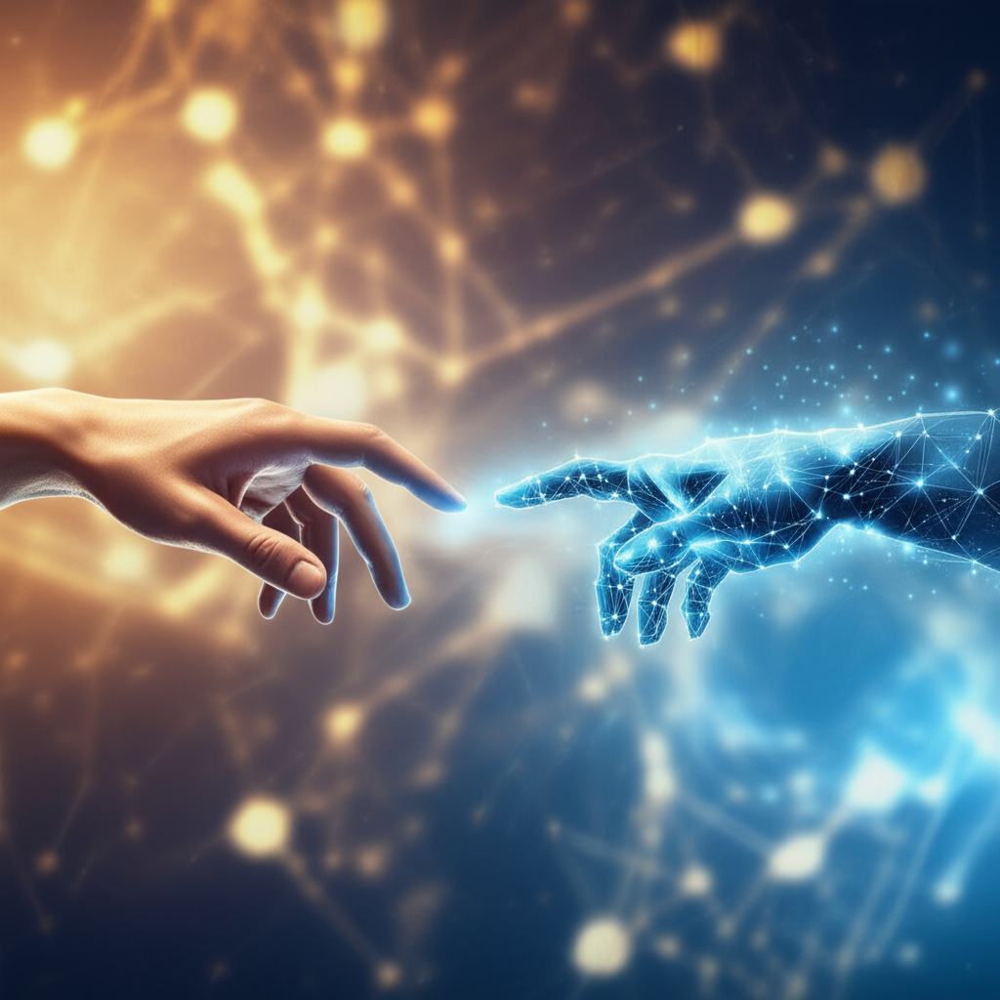

# 從指令到協作：重塑開發典範的 2025 年 AI 協作四大轉折點

## 前言：你的 AI 副駕，已從聊天室駛入你的專案核心

還記得 2023 年，我們在 IDE 和 ChatGPT 視窗間瘋狂複製貼上的日子嗎？那時的 AI 像個博學但健忘的實習生，雖然能給出精彩的程式碼片段，卻無法真正理解我們專案的全貌。我們像個循循善誘的導師，不厭其煩地提供上下文，只為求得一段可用的程式碼。

快轉到 2025 年，場景已截然不同。AI 不再僅僅是個「對話框裡的聰明腦袋」，它已經進化成一個深度整合在我們工作流程中的「協作夥伴」。它能閱讀整個專案、串接外部服務、甚至能化身為不同領域的專家團隊，與我們共同完成複雜的任務。

這一年，我們見證了 AI 協作從「點狀問答」到「立體協作網絡」的驚人躍進。這是一場從根本上改變我們工作方式的典範轉移。本文將以我個人的實戰經驗，歸納出推動這場革命的四個關鍵轉折點，並探討在這波浪潮中，我們人類的核心價值將如何重新定義。

---

## AI 協作的演進：從點、線到面

在深入探討四大轉折點之前，讓我們先建立一個思維框架：「點、線、面」的演進。

- **點 (Point):** 早期的 AI 對話是「一次性」的。你問一個問題，它給一個答案。每個互動都是一個孤立的「點」，缺乏連貫性。
- **線 (Line):** 隨著記憶功能的增強，AI 能記住對話的上下文，讓互動得以延伸成一條「線」。我們可以圍繞一個主題進行深入探討，而不會輕易失焦。
- **面 (Plane):** 2025 年的突破，則是將多條專家「線」整合起來，形成一個多維度的協作「面」。我們不再是與單一 AI 互動，而是指揮一個由多個 AI 專家組成的團隊。

這個「點→線→面」的框架，將貫穿我們接下來要探討的四大轉折。

---

## 轉折點一：專案級上下文感知 (Claude Code) —— AI 終於學會了閱讀

**第一個轉折，是 AI 從「失憶金魚」進化為「專案圖書館員」。**

年初，Anthropic 推出的 VS Code 擴充套件 **Claude Code**，徹底改變了遊戲規則。它最關鍵的突破，在於賦予 AI **檢視整個專案資料夾** 的能力。

這意味著，AI 不再需要我們手動餵養程式碼片段。它能像一位新加入的團隊成員一樣，自己去閱讀專案結構、理解程式碼之間的依賴關係、甚至參考過去的工作日誌（Work Log）。每一次的協作成果都被記錄下來，成為未來任務的養分。當你需要修改一個與三個月前某個功能相關的模組時，AI 不再是一臉茫然，而是能迅速調閱相關文件與程式碼，提供精準的建議。

這種專案級的上下文理解，將 AI 協作從脆弱的「對話線」，升級為一張穩固的「專案知識網」。溝通成本大幅降低，協作的深度與廣度也因此得到了前所未有的提升。

---

## 轉折點二：外部工具調用 (MCP) —— AI 伸出連接真實世界的觸手

**第二個轉折，是 AI 打破了數位牢籠，學會了與外部世界互動。**

如果說 Claude Code 讓 AI 擁有了「眼睛」和「記憶」，那麼 **MCP (Model Context Protocol)** 的普及，則為它裝上了「手臂」。MCP 允許大型語言模型安全地與外部 API 和工具進行互動。

我喜歡用《駭客任務》中的機械烏賊（Sentinel）來比喻這個概念。MCP 就像 Sentinel 身上那些可以隨意伸縮、接駁各種系統的萬用觸手。需要分析設計稿？AI 伸出觸手接上 Figma。需要自動化一個工作流？它接上 n8n。需要管理程式碼版本？它直接與 GitHub API 對話。

AI 不再是一個只能紙上談兵的「顧問」，而是成為一個能親自動手的「執行者」。它可以在 VS Code 這個「智慧中樞」內，調度各種外部服務來完成任務。從前需要我們手動在多個平台間切換、操作的繁瑣流程，如今只需對 AI 下達一個指令，便能一氣呵成。這使得 VS Code 真正成為了一站式的 AI 協作指揮中心。

---

## 轉折點三：專家代理人 (Subagents) —— 如同 Trinity 瞬間載入專業技能

**第三個轉折，是 AI 從「通才」進化為「專家團隊」。**

還記得《駭客任務》中，Trinity 為了救 Neo，說了句「我需要學會開 B-212 直升機」，下一秒，駕駛技能就被瞬間下載到她腦中嗎？**Subagents** 的概念正是如此。

在 Claude Code 中，我們可以透過 `.claude/agents/` 目錄下的描述檔，定義不同角色的「專家代理人」。你可以創建一個嚴謹的「資深測試工程師」、一個善於規劃的「敏捷專案經理」、或是一個天馬行空的「創意文案大師」。

當你面對一項任務時，不再是與一個泛用的 AI 對話，而是可以召喚對應的專家。例如，當你需要規劃專案時程，你啟動「專案經理」Agent；當你需要重構程式碼，你呼叫「系統架構師」Agent。

這正是「點→線→面」演進中的「面」——我們的工作區不再是單一的對話線，而是由多個專家對話線交織而成的協作平面。你可以隨時根據任務需求，組建一支夢幻 AI 團隊，而你，就是這個團隊的指揮官。

---

## 轉折點四：自主技能 (Skills) —— AI 獲得了「神經反射」

**第四個轉折，是 AI 從「被動執行」邁向「主動判斷」。**

如果說 Subagents 讓 AI 擁有了「特化手臂」，那麼 **Skills** 功能就為這些手臂裝上了「自主反應的神經」。

Skills 是定義在 `~/.claude/skills/` 目錄中的一組可重用指令集。與 Subagents 不同，Skills 可以由 AI **自主判斷並調用**。

舉個例子：過去，當 AI 寫完一段程式碼後，你需要明確指示它「請執行單元測試」。但現在，如果你定義了一個名為 `run_unit_tests` 的 Skill，AI 在完成程式碼撰寫後，可能會自主判斷：「根據任務上下文，我應該運行測試來驗證我的程式碼。」然後自動調用該 Skill。

這是一個從「被動聽令」到「主動解決問題」的質變。AI 不再只是等待我們下達一個個具體指令的操作員，而是能夠理解「任務目標」，並自主拆解、調用技能來達成目標的智慧夥伴。這極大地降低了我們的認知負擔，讓我們能更專注於「做出決策」，而不是「分派執行任務」。

---

## 結論：從「操作員」到「指揮官」—— 我們在 AI 時代的新價值

回顧 2025 年，AI 協作的四次躍進，將 AI 從一個工具，變成了我們的夥伴。這個夥伴不僅能理解我們的專案（Claude Code）、與世界互動（MCP）、扮演專家（Subagents），甚至能主動思考如何完成任務（Skills）。

這場變革中，我們人類的角色也發生了深刻的轉變——我們正從繁瑣的「操作員」，進化為宏觀的「指揮官」和「決策者」。

我們的價值不再是寫出每一行程式碼，或執行每一個命令。我們的核心價值在於：

- **定義願景與目標：** 我們決定要去哪裡。
- **做出關鍵決策：** 在十字路口，我們選擇方向。
- **進行創造性思考：** 我們提出 AI 無法獨立想出的突破性想法。
- **承擔最終責任：** 我們對結果負責。

2025 年，AI 協作讓我們得以從重複性勞動中解放出來，將更多的精力投入到真正需要人類智慧的戰略性和創造性工作中。這不是一個「被取代」的故事，而是一個「被增強」的序章。站在 2026 年的開端，我們有理由相信，更精彩的人機協作新紀元，才剛剛開始。

